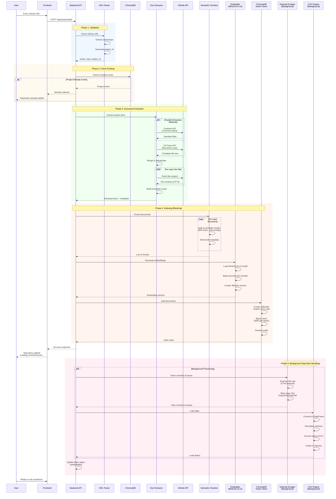
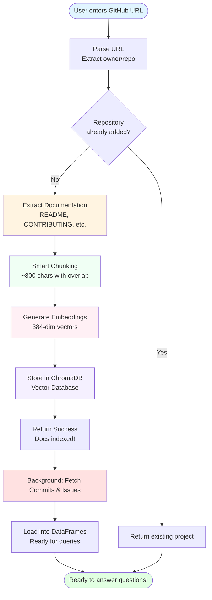
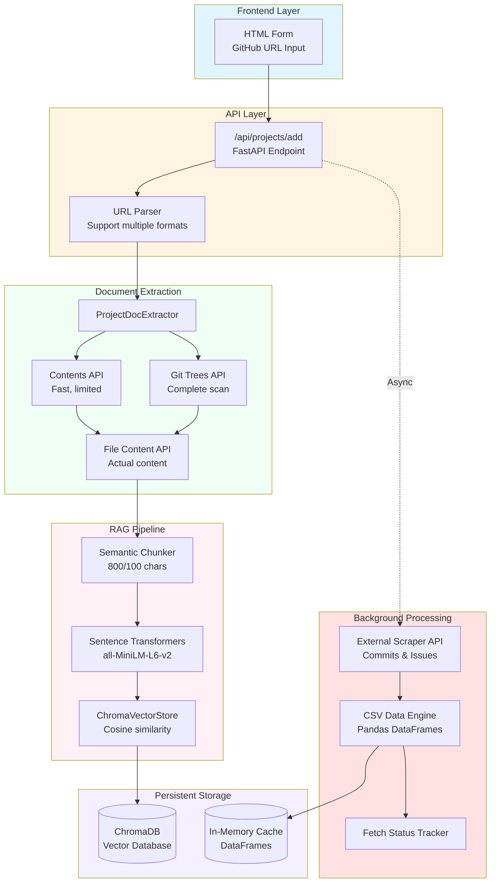
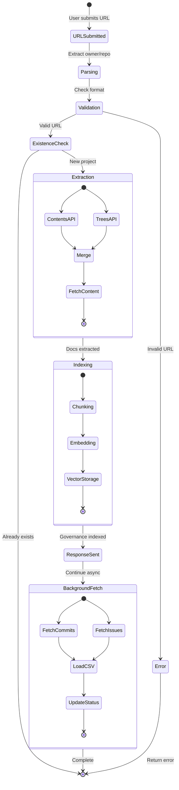

# RepoWise - Add Repository Flow Diagram

## Complete Process Flow

## Simplified User-Facing Flow

## Technical Component Breakdown

## Data Flow During Add Repository

## Time Breakdown (Typical Repository)

| Phase | Duration | Blocking? | Description |
|-------|----------|-----------|-------------|
| URL Parse | <100ms | ✅ Yes | Extract owner/repo |
| Existence Check | <200ms | ✅ Yes | Query ChromaDB |
| Doc Extraction | 2-5s | ✅ Yes | GitHub API calls |
| Chunking | 500ms-1s | ✅ Yes | Split documents |
| Embedding | 1-3s | ✅ Yes | Generate vectors (CPU) |
| ChromaDB Insert | 500ms-1s | ✅ Yes | Persist vectors |
| **User sees success** | **~5-10s** | - | Frontend updated |
| Commits/Issues Fetch | 30-60s | ❌ No | External scraper |
| DataFrame Loading | 2-5s | ❌ No | Pandas processing |
| **Fully ready** | **~40-70s** | - | All data available |
